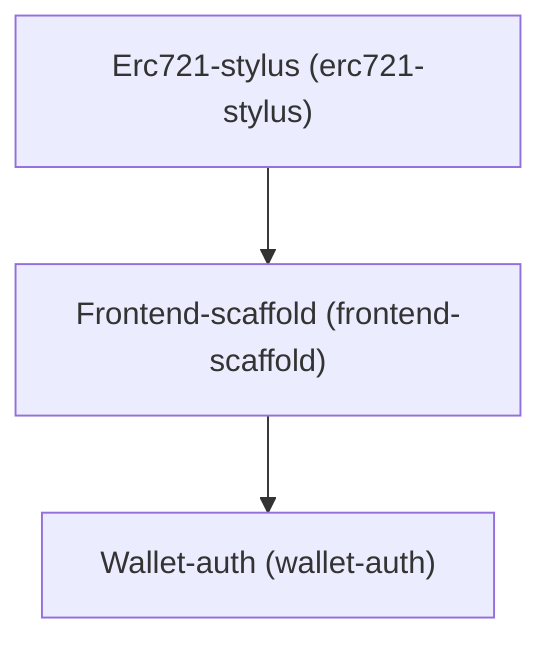

# Architecture

## Dependency Graph

```mermaid
graph TD
  3503d9bd["Erc721-stylus (erc721-stylus)"]
  236d1301["Frontend-scaffold (frontend-scaffold)"]
  033cb90c["Wallet-auth (wallet-auth)"]
  3503d9bd --> 236d1301
  236d1301 --> 033cb90c
```

## Execution / Implementation Order

1. **Erc721-stylus** (`3503d9bd`)
2. **Frontend-scaffold** (`236d1301`)
3. **Wallet-auth** (`033cb90c`)
